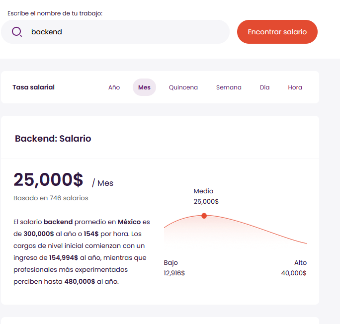
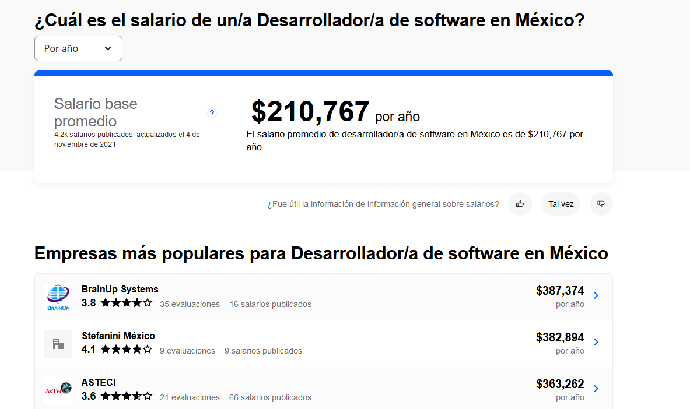
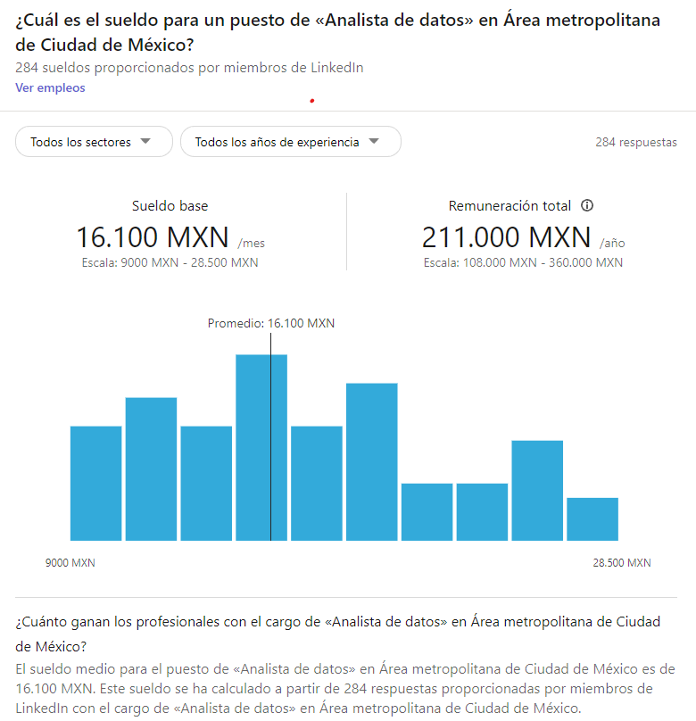
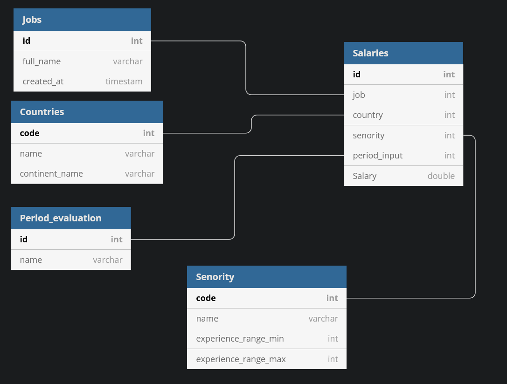

# Research team

Estructura de paginas 
- Talent

    Datos manejados
    - Puesto
    - Salario
    - Periodo
    - Salarios Evaluados
    - Pais
    
    

- Glassdoor

    Datos manejados
    - Puesto
    - Descripción
    - Empresa
    - Salario
    - Periodo(mensual/anual)
    - Salarios Evaluados
    - Pais
    - Vacantes similares

- Indeed

    Datos manejados
    - Puesto
    - Salario
    - Periodo(mensual/anual)
    - Salarios Evaluados
    - Pais
    - Vacantes con el puesto
    - Top salarios por region
    

- LinkedIn Salary

    Datos manejados
    - Puesto
    - Salario  promedio
    - Salario maximo
    - Salario  minimo
    - Experiencia
    - Periodo(mensual/anual)
    - Salarios Evaluados
    - region
    - Ubicaciones con mejor salario
    - Empleos actuales
    - Bonos 

    

- propuesta schema
    

    - Id 
    - Puesto
    - Salario  promedio
    - Salario maximo
    - Salario  minimo
    - Senority
    - Periodo(mensual/anual)
    - Ubicacion

